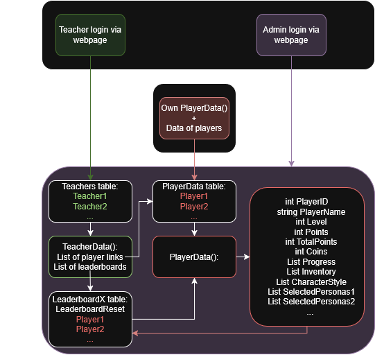

# Server requirement document
This document details how the game works and how it needs to communicate with a database. It is structured to have 2 goals. One for the current scope of the prototype (Prototype goal) and the future ideas and working of the system as desribed in the text below. All the communication can be done via `JSON` as will also be shown at the Users header.

Any questions regarding this document can be directed to: l.f.c.schrauwen@students.uu.nl

Firstly the game will be explained followed by the users of the system and how the network should work.

## Mobile Game
The mobile game is made for Adolescents in practical schools to help with identity development. The game is set around a single 3D school world where the player does minigames, collects points, and quests given by NPC's while being able to also roam around the school grounds freely. The game will have a leaderboard every X amount of time where the adolescents will be competing against eachother and trying to get the most points. The players will be able to text with other players and see them in the world.

## Users
The system has different users because the game is deployed from school. This allows the teachers to have moderate control over how the players experience the game and they can nudge players to do things that the teacher deem better for the student. The users that interact with the system are the following:
- `Admin`
- `Teacher`
- `Player`

### Teacher
The `Teacher` role is made for the teachers of the schools that all can access a set of `Player`s that is given to it by the `Admin`. This is similar to giving a teacher a class of students. Every `Teacher` has unique players assigned to them so teachers can not share `Player`s. The `Teacher` accesses the interface via a website and login.

The `Teacher` has control but also can just use the default values and never interact with the system at all. The role of the `Teacher` is to:
- Decide the leaderboard groups for the `Player`s. 
    - `Default`: All `Player`s under the `Teacher` are in one leaderboard.
- Decide the leaderboard running time. For example every week or month.
    - `Default`: Every month the leaderboard resets and rewards are handed out ingame.
- Control what kind of minigames the `Player`s get by setting restrictions to some minigames to not occur anymore or reduced occurance.
    - `Default`: There are no restrictions, every minigame is handled equally.
- Have an insight into the texts the `Player`s send to eachother and can block texts between `Player`s.
    - `Default`: Every player can contact/text every other player in the same leaderboard.

The `Teacher` has limited access to the data of every `Player` only seeing what they need to perform the above tasks. The `Teacher` holds roughly the list of aatributes below.

- `List<Player> AssignedPlayers`
- `List<Leaderboard> CreatedLeaderboards`
    - Every leaderboard has `int LeaderBoardReset` and `List<PlayerID> Players`

### Admin
The `Admin` has the most rights of all users and will setup the system for all `Player`s and `Teacher`s by creating them and assigning the `Player`s to `Teacher`s and providing them all with the details to login (a unique code or something to create the account link). The `Admin` has also insight in all `Player`s and can also block texts or move `Player`s to other leaderboards. The `Admin` will access the system via the same way as the `Teacher`s.

### Player
Plays the game on a mobile phone and can only access the data of other `Player`s via the game itself and then will only see total points and activities completed. The data the `Player` holds in the game are below.

- `int PlayerID`
- `string PlayerName`
- `int Level;`
- `int Points;`
- `int TotalPoints;`
- `int Coins;`
- `List<ActivityData> Progress;` 
- `List<ItemData> Inventory;`
- `List<string> CharacterStyle;`
- `List<string> SelectedPersonas1;`
- `List<string> SelectedPersonas2;`
- `List<string> SelectedPersonas3;`
- `List<string> SelectedPersonas4;`
- `List<string> SelectedPersonas5;`
- `List<string> SelectedPersonas6;`
- `List<string> SelectedPersonasSchool;`

Set by the `Teacher`:
- `int LeaderboardGroupID;`
- `List<PlayerID> ChatRestrictions; `
- `List<ActivityID> MiniGameRestrictions;`

## System structure
The system consist of the following components:
- The mobile game for the `Player`
- The webpage to login for the `Teacher` and `Admin`
- The database

Arrows indicate the flow of what information a user can see if the direction of the arrows can be followed.

The `Teacher` will be able to access its own data from the `Teacher` table which includes all the teachers with their data as described earlier.

The `Player` will be able to access its data from the `Player` table and accesses a restricted amount of data from other players in its own leaderboard group table.

The `Admin` can access all data.

## Goals
### Prototype goal
This is the goal of what needs to be done for the prototype that is in the making and will be finished at the end of April.

The `Teacher` and `Admin` users do not exist yet for the prototype. 
- The mobile game should read and write from the `Player` its own data. 
- The mobile game should be able to read all data (no restrictions yet) from all other `Player`s. (For the prototype we assume all players are in the same leaderboard)
- The mobile game should read the reset value of the leaderboard which will be set to one month statically for now

